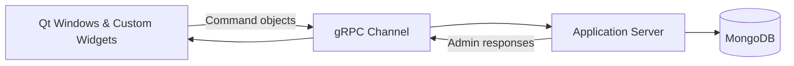

# Lets_Go_Desktop_Interface — Qt admin console for ops & moderation

Qt/C++ desktop tool for operating the Lets Go platform. It uses **gRPC/Protobuf** to talk to the server and gives admins fast, reliable workflows for moderation, events, error triage, and light operations.

> **Stack:** C++ · Qt Widgets · gRPC/Protobuf client  
> **Talks to:** Lets_Go_Server (C++ gRPC) · MongoDB (via server APIs)

---

---

## Highlights (skim me)
- **Purpose-built UI:** designed for speed and reliability over flashiness.
- **Typed RPCs:** one command object per admin action; simple, testable flows.
- **Operational tools:** load checks, controlled shutdowns, category/icon management.
- **Reusable widgets:** image-safe labels, max-char editors, rich message displays.

---

## What admins can do
- **Events:** add new events and cancel existing ones.  
- **Errors:** view/extract errors, search, and **mark a type as handled**; delete single errors post-review.  
- **Feedback & reports:** review user feedback; triage reports and dismiss/resolve them.  
- **User management:** find a user, update profile fields, and change **account state** (suspended/banned).  
- **Statistics:** inspect pre-aggregated app stats and trends.  
- **Operations:** view server load; **request controlled server shutdown** with safety prompts.

---

## How it works (high level)
- **Windows:** dedicated screens for Home, Users, Reports, Errors, Statistics, and Events.  
- **Commands:** each action maps to a small RPC wrapper with shared logging/retry.  
- **Channel:** a single configured gRPC channel reused across requests.

---

## Code tour (where to look)

**UI**
- `project/primary_windows/` — top-level windows  
  - `home_window/`, `find_user_window/`, `reports_window/`, `errors_window/`, `statistics_window/`  
  - `add_event_window/`, `cancel_event_window/`, `set_fields_window/`, `set_default_picture/`, `shutdown_servers/`
- `project/custom_widgets/` — reusable widgets  
  - `display_user_widget_window/`, `display_user_picture_widget/`, `display_chat_message_widget/`  
  - `aspect_ratio_pixmap_label/`, `plain_text_edit_with_max_chars/`, `access_status_invalid_message_dialog/`

**Networking & globals**
- `project/grpc/grpc_channel/` — channel setup and reuse  
- `project/global_values/` — shared constants and config

**Admin commands (RPC wrappers)**
- `project/utility/request_from_server/` — one folder per operation  
  - *Events & load:* `add_admin_event/`, `cancel_event/`, `get_events/`, `retrieve_server_load/`  
  - *Errors & reports:* `extract_errors/`, `search_errors/`, `set_error_to_handled/`, `delete_single_error/`, `dismiss_report/`  
  - *Users & media:* `remove_user_picture/`, `time_out_user/`, `set_default_picture/`  
  - *Catalog mgmt:* `request_server_icons/`, `request_server_activities_categories/`, `set_server_icon/`, `set_server_category/`, `set_server_activity/`  
  - *Ops safety:* `request_server_shut_down/`  
  - *Base class:* `run_server_call_base_class/` (common logging/retry)
- Other utilities:  
  - `project/utility/general_utility/`, `project/utility/log/` — helpers & logging  
  - `project/setup_login_info/` — admin auth/connection setup  
  - `Resources/images/` — icons and UI assets

---

## Design choices
- **Desktop over web** for low-latency, stable windowed workflows and predictable packaging.  
- **Command-per-action** keeps RPC surfaces clear and easy to extend.  
- **Reusable widgets** reduce UI bugs in image rendering and long-text editing.  
- **Typed contracts** (Protobuf) prevent payload drift across client/server.

---

## Related

- **Android Client (Kotlin)** — auth, profiles, activities, chat *(SDK versions may be dated)*  
  👉 [`Lets_Go_Android_Client`](https://github.com/lets-go-app-pub/Lets_Go_Android_Client)

- **Server (C++)** — stateless hub, gRPC/Protobuf, MongoDB  
  👉 [`Lets_Go_Server`](https://github.com/lets-go-app-pub/Lets_Go_Server)

- **Protobuf Files** — protobuf files used to communicate between server and clients  
  👉 [`Lets_Go_Protobuf`](https://github.com/lets-go-app-pub/Lets_Go_Protobuf)

## Status & compatibility
Portfolio reference. Built with Qt at the time of development; modern Qt toolchains/licensing may be required to build.

## License
MIT
